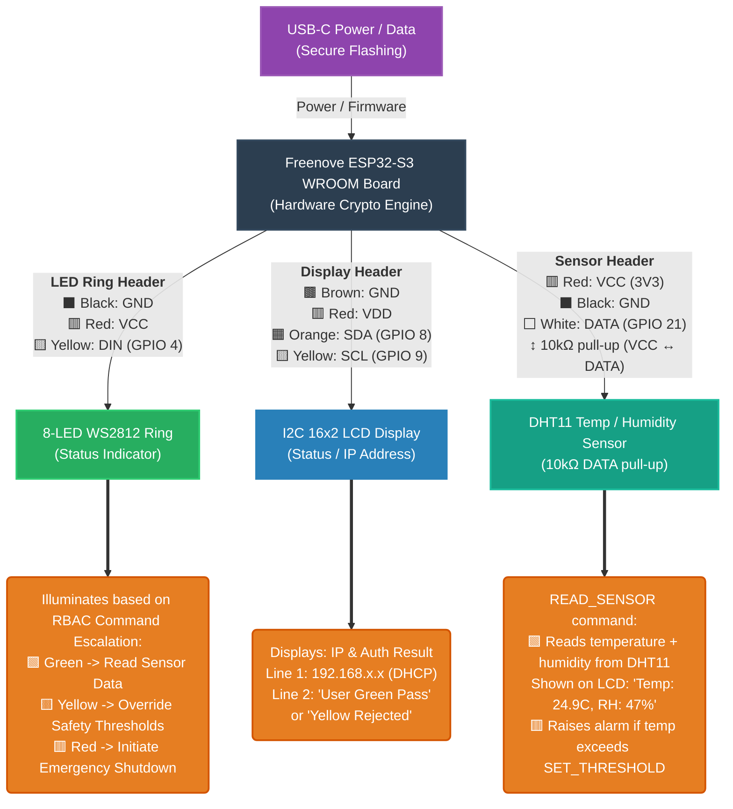

# Critical Infrastructure Hardware Lockdown

A modern, highly secure blueprint for IoT and embedded devices in critical infrastructure environments.

## The Rationale

Critical infrastructure worldwide is currently facing an unprecedented vulnerability crisis. The security posture of operational technology and industrial control systems is often inadequate due to a combination of systemic challenges:

1. **Outdated Standards:** Many deployments rely on legacy security standards that were designed before the era of persistent, well-funded nation-state threat actors. 
2. **Slow Pace in Industry:** The physical engineering and industrial sectors historically move slowly. Hardware iterations take years, and updating protocols in production environments is treated as a high-risk liability.
3. **Failure to Adopt Modern Tech:** The industry has been overwhelmingly slow to adopt recent, massive leaps in both Artificial Intelligence (for threat modeling and automated security auditing) and embedded software (such as memory-safe languages like Rust).
4. **The Talent Gap & AI Acceleration:** There is a well-documented shortage of cybersecurity and embedded engineering talent globally. However, this gap can now be bridged. By leveraging advanced AI coding assistants, teams can rapidly deploy highly complex hardware security paradigms (like Hardware Security Module signing and PKCS#11 integration) that would have previously required entire teams of specialized cryptographers.

## Project Vision

This project demonstrates that it is now possible to build *impenetrable* embedded devices using commercially available microcontrollers (ESP32-S3), modern memory-safe systems languages (Rust), and enterprise-grade hardware cryptography (PIV Smart Cards) — all accelerated by AI.

### Features
*   **Memory-Safe Firmware:** 100% Rust (`no_std`) — no buffer overflows, no memory corruption.
*   **Hardware Cryptographic RBAC:** every command carries a hardware-held client signature — **Ed25519** on the web/HTTP flavor, **P-256** on the native/UDP flavor — and the device verifies a supervisor→role certificate chain before acting.
*   **Two transports, one crypto core:** a browser dashboard (HTTP + **WebAuthn-PRF** passkeys) and a native macOS client (UDP + **Secure Enclave** or a **Token2 PIV** hardware key) share one signed + encrypted command envelope — see [`clients/apple`](clients/apple).
*   **Hardware-Rooted Device Identity (burned + validated):** the device's X25519/Ed25519 keys are derived at boot from a **read-protected eFuse HMAC key** — the root never touches software and can't be cloned, even with physical access. On the reference board this is burned, with **JTAG disabled**; the secure-download read-lock and flash encryption are documented as the final seal.
*   **HSM Secure-Boot Signing (validated):** RSA-3072-PSS Secure Boot v2 images are signed by a **Token2 PIV** key via OpenSC PKCS#11 — the private key never leaves the token (signed + verified end-to-end). Full Secure Boot v2 enablement (signed ESP-IDF bootloader + the irreversible digest/enable burns) is the documented last step.

## Hardware Schematic




## Building & Running

### Hardware

Every part is in a single kit — the [Freenove Ultimate Starter Kit for ESP32-S3](https://www.amazon.de/dp/B0BMQ2CPQN) (board, breadboard, WS2812 LEDs, I2C 16x2 LCD, DHT11, jumpers, resistors). Wire it per the schematic above:

- WS2812 LED ring → DIN on **GPIO 4**
- I2C LCD (address `0x27`) → SDA **GPIO 8**, SCL **GPIO 9**
- DHT11 → DATA on **GPIO 21**, with a **10 kΩ pull-up** between DATA and VCC (3V3)

#### Security hardware (optional — for the hardware-key + secure-boot demo)

| Item | Role | Link |
|---|---|---|
| **Token2 T2F2 PIN+** (Release 3.3, USB-C) | Supervisor identity (ECC P-256, PIV slot 9c) **+** primary Secure Boot v2 signer (RSA-3072, PIV slot 9a) | [token2.com](https://www.token2.com/shop/product/t2f2-pin-release3-typec) |
| **Thetis Pro FIDO2 Security Key** | Backup Secure Boot v2 signer (RSA-3072, PIV) | [amazon.de](https://www.amazon.de/dp/B0DPR855Q7) |
| **keyroost** (software) | Generates ECC/RSA keys **on-card** in PIV slots — used to provision both keys above | [github.com/framefilter/keyroost](https://github.com/framefilter/keyroost) |

Both are standard **PIV** smart cards reached via OpenSC PKCS#11. A Mac's Secure Enclave also works for the *supervisor* (Touch ID), but can't hold the RSA-3072 secure-boot key (P-256 only). Details in [`docs/formal/EFUSE-HARDENING.md`](docs/formal/EFUSE-HARDENING.md).

### Prerequisites

- Rust + the Espressif toolchain via [`espup`](https://github.com/esp-rs/espup): `espup install`, then `source ~/export-esp.sh` (used only for the firmware; the toolchain is pinned by `rust-toolchain.toml`)
- `cargo install espflash trunk` and `rustup target add wasm32-unknown-unknown`
- `php` (for the dashboard's HTTP→device proxy)

### 1. Flash the firmware

```sh
./flash.sh <WIFI_SSID> <WIFI_PASSWORD> <SUPERVISOR_PUBKEY_HEX>
```

Wi-Fi credentials and the trusted supervisor key are baked in at compile time (`option_env!`) — never stored in the repo. On boot the device prints three public keys over serial; note them for step 2:

```
SSOT Supervisor PubKey:                <the key you flashed>
ESP32 Ed25519 Response-Signing PubKey: <64 hex chars>
ESP32 X25519 PubKey:                   <64 hex chars>
```

### 2. Run the dashboard

```sh
./run_dashboard.sh    # builds + serves the Leptos webapp on http://localhost and opens your browser
```

Served on `http://localhost` (a WebAuthn secure context, so no HTTPS needed) and the app talks to the device's HTTP endpoint directly — no proxy. Click **Register New Passkey** (WebAuthn PRF), then fill the connection panel — nothing is hardcoded, and the values persist in the browser's LocalStorage:

| Field | Value |
|-------|-------|
| ESP32 IP | shown on the LCD |
| ESP32 ROM Pubkey | the **X25519** key from the boot log |
| ESP32 Sig Pubkey | the **Ed25519 Response-Signing** key from the boot log |
| Supervisor Pubkey | your supervisor public key |

### Hosting: local vs. remote

The dashboard is a **static WASM bundle** (`trunk build` → `dist/`) that talks to the device over HTTP. Two browser rules decide where you can host it:

- **WebAuthn needs a secure context** — satisfied by `https://` **or** `http://localhost`.
- **A page can only reach its own security level** — an `https://` page may not call a plaintext `http://` device (mixed content). Browser code also can't open a raw TCP socket at all, which is why the firmware serves HTTP rather than a bare socket. The command envelope is end-to-end encrypted and signed (X25519 + AES-GCM + Ed25519), so plaintext HTTP transport leaks nothing and can't be forged — **no TLS to the device is required**.

**Local (recommended — zero infrastructure).** `./run_dashboard.sh` serves the bundle from `http://localhost`. That's a secure context (WebAuthn works) *and* an http origin (so it may `fetch("http://<device>:8080/")` directly). Enter the device's LAN IP — done. No proxy, no HTTPS, no certificate.

**Remote / off-LAN.** As soon as the app is served over HTTPS (a public host, GitHub Pages, …), the browser forbids it from calling a plaintext device — so the *device* needs an HTTPS front (a tunnel or reverse proxy; impractical to run on the ESP itself). Separately, whatever hosts that front must have a network route to the device — the browser is never the one connecting to it.

| App served at | WebAuthn | Reach the device by |
|---|---|---|
| `http://localhost` (this repo's default) | ✅ localhost is a secure context | its **LAN IP** directly — no proxy |
| `http://<lan-ip>` (another LAN box) | ❌ not a secure context | works, but WebAuthn needs a local cert |
| `https://…` (remote / GitHub Pages) | ✅ | an **`https://` front** for the device (tunnel / reverse proxy) |

Reachability for the remote case is pure networking — a VPN into the device's network, or a routable public IP / DynDNS + port-forward (carrier LTE is usually CGNAT, so an outbound tunnel like Cloudflare/Tailscale is the robust option). The app itself never changes; it just points at wherever the device is reachable.

### Native macOS client (UDP flavor)

Instead of the browser, drive the device from a native **SwiftUI macOS app** over UDP — signatures come from this Mac's **Secure Enclave** (Touch ID) or a **Token2 PIV** hardware key, with no domain/passkey ceremony. Flash the UDP ROM flavor and open the app:

```sh
./flash-udp.sh <WIFI_SSID> <WIFI_PASSWORD> <SUPERVISOR_P256_PUBKEY_66HEX>
open clients/apple/CriticalInfra.xcodeproj    # ⌘R (destination: My Mac)
```

The **supervisor** identity can be a portable **Token2 PIV** key (ECCP256 in slot 9c, PIN per command) rather than a Mac-bound enclave key — the same card that signs Secure Boot v2 images (RSA-3072 in slot 9a). Full walkthrough — hardware-key provisioning, the macOS CryptoTokenKit gotchas, Touch ID — in [`clients/apple/README.md`](clients/apple/README.md).

### Production hardening (eFuse)

Root the device identity in a **read-protected eFuse HMAC key** instead of flash, and lock the chip down:

```sh
./efuse-harden.sh rehearse    # dry-run the entire burn sequence on a virtual eFuse (no hardware)
./efuse-harden.sh check       # read-only: the real chip's current fuse state
# firmware that derives its identity from the eFuse root (panics if the key is absent):
cd target-esp32s3 && cargo build --release --no-default-features --features "udp-transport,efuse-hmac-identity"
```

The full **hardware-validated** runbook — HMAC identity root → JTAG off → secure-download read-lock, plus the Token2 RSA-3072 Secure Boot v2 signing flow — is in [`docs/formal/EFUSE-HARDENING.md`](docs/formal/EFUSE-HARDENING.md). Every command was rehearsed on a virtual ESP32-S3 (`espefuse --virt`) before burning; on the reference board the identity + JTAG stages are done.

> ⚠️ eFuse writes are **irreversible** (bits only go 0 → 1). Rehearse with `./efuse-harden.sh rehearse`, verify between stages, and leave the read-lock (`ENABLE_SECURITY_DOWNLOAD`) and Secure Boot for last.

## License

This project is licensed under the MIT License - see the [LICENSE](LICENSE) file for details.

---
*Made with [**Google Antigravity**](https://antigravity.google) (Antigravity CLI `agy`) 🚀 + [**Claude Opus**](https://claude.com)*
