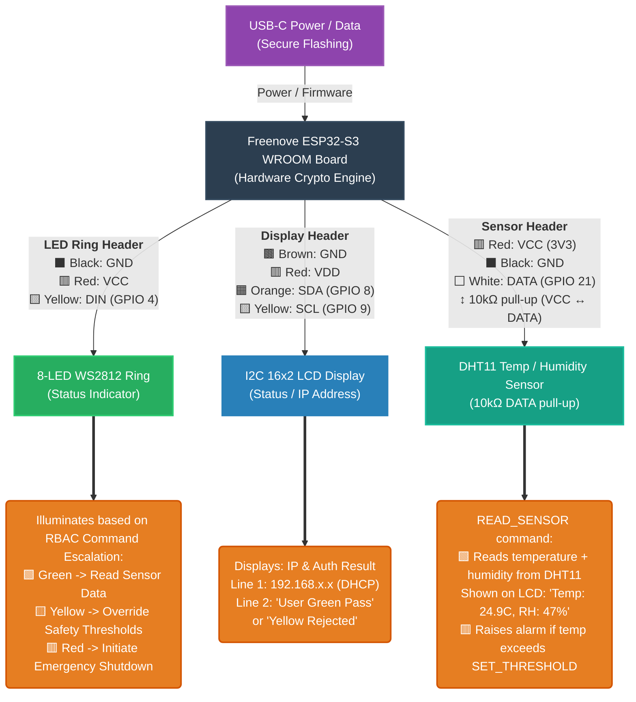
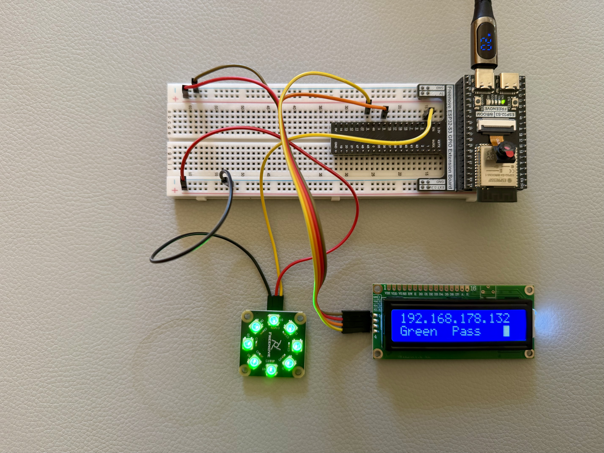

# Critical Infrastructure Hardware Lockdown

A modern, highly secure blueprint for IoT and embedded devices in critical infrastructure environments.

## The Rationale

Critical infrastructure worldwide is currently facing an unprecedented vulnerability crisis. The security posture of operational technology and industrial control systems is often inadequate due to a combination of systemic challenges:

1. **Outdated Standards:** Many deployments rely on legacy security standards that were designed before the era of persistent, well-funded nation-state threat actors. 
2. **Slow Pace in Industry:** The physical engineering and industrial sectors historically move slowly. Hardware iterations take years, and updating protocols in production environments is treated as a high-risk liability.
3. **Failure to Adopt Modern Tech:** The industry has been overwhelmingly slow to adopt recent, massive leaps in both Artificial Intelligence (for threat modeling and automated security auditing) and embedded software (such as memory-safe languages like Rust).
4. **The Talent Gap & AI Acceleration:** There is a well-documented shortage of cybersecurity and embedded engineering talent globally. However, this gap can now be bridged. By leveraging advanced AI coding assistants, teams can rapidly deploy highly complex hardware security paradigms (like Hardware Security Module signing and PKCS#11 integration) that would have previously required entire teams of specialized cryptographers.

## Project Vision

This project demonstrates that it is now possible to build *impenetrable* embedded devices using commercially available microcontrollers (ESP32-S3), modern memory-safe systems languages (Rust), and enterprise-grade hardware cryptography (PIV Smart Cards) — all accelerated by AI.

### Features
*   **Memory-Safe Firmware:** Written in 100% Rust (`no_std`) to eliminate buffer overflows and memory corruption vulnerabilities.
*   **Hardware Cryptographic RBAC:** All commands are signed using Ed25519 signatures, ensuring strict Role-Based Access Control.
*   **True Hardware Security Module (HSM) Boot:** The ESP-IDF bootloader and Rust firmware are signed offline using an air-gapped PKCS#11 Smart Card token (such as a Token2 T2F2). 
*   **Irreversible eFuse Lockdown:** Bootloader verification hashes and AES-256 Flash Encryption keys are permanently burned into the silicon, making physical tampering impossible.

## Hardware Schematic

## License

This project is licensed under the MIT License - see the [LICENSE](LICENSE) file for details.

---
*Made with [**Google Antigravity**](https://antigravity.google) (Antigravity CLI `agy`) 🚀*
