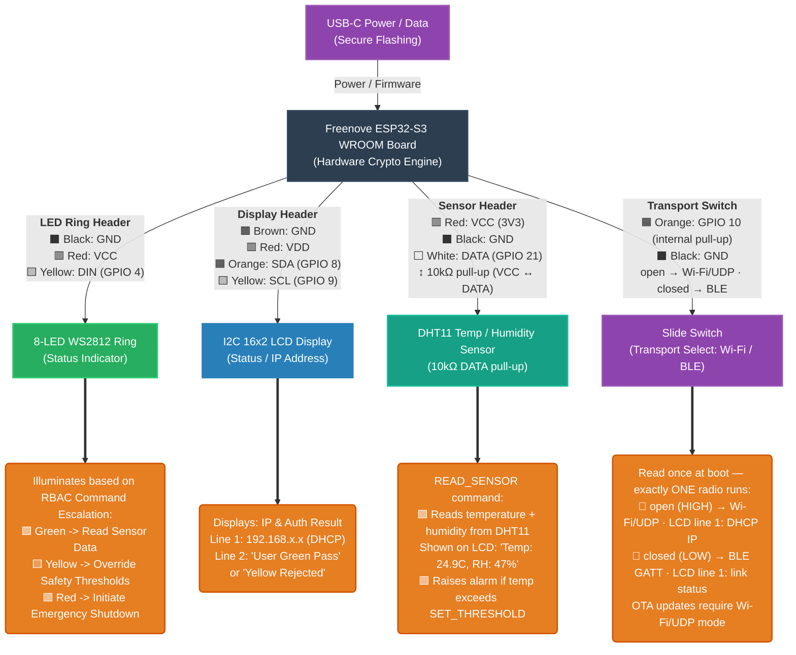
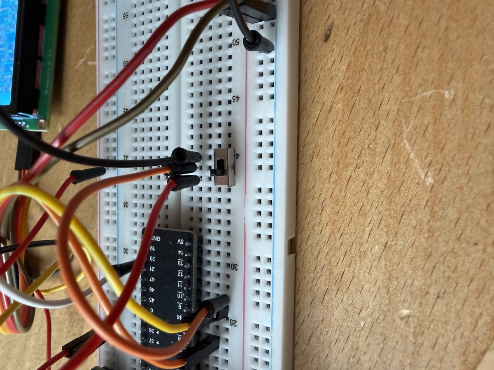
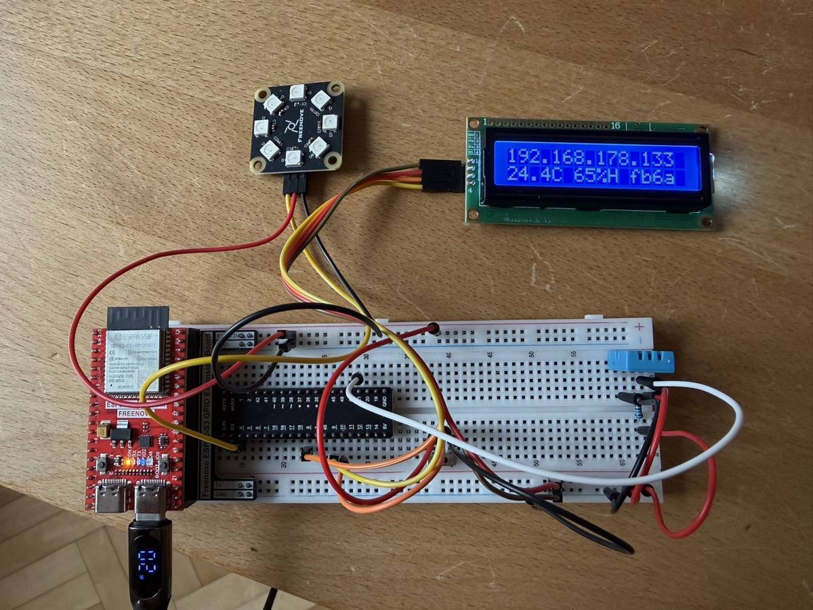
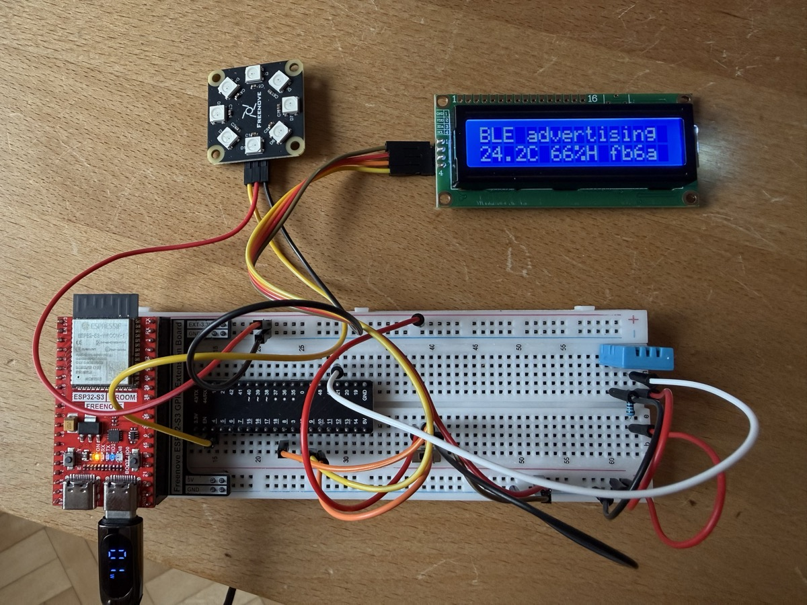

# Critical Infrastructure Hardware Lockdown

A modern, highly secure blueprint for IoT and embedded devices in critical infrastructure environments.

## The Rationale

Critical infrastructure worldwide is currently facing an unprecedented vulnerability crisis. The security posture of operational technology and industrial control systems is often inadequate due to a combination of systemic challenges:

1. **Outdated Standards:** Many deployments rely on legacy security standards that were designed before the era of persistent, well-funded nation-state threat actors. 
2. **Slow Pace in Industry:** The physical engineering and industrial sectors historically move slowly. Hardware iterations take years, and updating protocols in production environments is treated as a high-risk liability.
3. **Failure to Adopt Modern Tech:** The industry has been overwhelmingly slow to adopt recent, massive leaps in both Artificial Intelligence (for threat modeling and automated security auditing) and embedded software (such as memory-safe languages like Rust).
4. **The Talent Gap & AI Acceleration:** There is a well-documented shortage of cybersecurity and embedded engineering talent globally. However, this gap can now be bridged. By leveraging advanced AI coding assistants, teams can rapidly deploy highly complex hardware security paradigms (like Hardware Security Module signing and PKCS#11 integration) that would have previously required entire teams of specialized cryptographers.

## Project Vision

This project demonstrates that it is now possible to build *impenetrable* embedded devices using commercially available microcontrollers (ESP32-S3), modern memory-safe systems languages (Rust), and enterprise-grade hardware cryptography (PIV Smart Cards) — all accelerated by AI.

### Features
*   **Memory-Safe Firmware:** 100% Rust (`no_std`) — no buffer overflows, no memory corruption.
*   **Hardware Cryptographic RBAC:** every command carries a hardware-held **P-256** client signature — from a Mac's **Secure Enclave** (Touch ID) or a **PIV** hardware key — and the device verifies a supervisor→role certificate chain before acting.
*   **Native client, encrypted envelope:** a **SwiftUI macOS app** drives the device over a raw UDP command protocol — one signed + encrypted envelope (X25519 + AES-GCM + Ed25519), machine-checked in Tamarin — see [`clients/apple`](clients/apple).
*   **Dual transport, one envelope (hardware-verified):** the same signed envelope also runs over **BLE GATT** — no Wi-Fi/LAN needed (commissioning, network-down, iOS). A physical switch on GPIO10 picks the radio at boot (one at a time, no coex); roles and state are shared between transports — see [`docs/formal/BLE-TRANSPORT.md`](docs/formal/BLE-TRANSPORT.md).
*   **Hardware-Rooted Device Identity (burned + validated):** the device's X25519/Ed25519 keys are derived at boot from a **read-protected eFuse HMAC key** — the root never touches software and can't be cloned, even with physical access. On the reference board this is burned, with **JTAG disabled**; the secure-download read-lock and flash encryption are documented as the final seal.
*   **HSM Secure-Boot Signing (validated):** RSA-3072-PSS Secure Boot v2 images are signed by a **PIV** key via OpenSC PKCS#11 — the private key never leaves the token (signed + verified end-to-end). Full Secure Boot v2 enablement (signed ESP-IDF bootloader + the irreversible digest/enable burns) is the documented last step.

## Hardware Schematic




### Transport select — one switch, two radios

A slide switch between **GPIO10 and GND** picks the transport at boot (internal pull-up,
active-low; see [`docs/formal/BLE-TRANSPORT.md`](docs/formal/BLE-TRANSPORT.md)):



| Wi-Fi/UDP mode (switch open) | BLE mode (switch closed) |
| --- | --- |
|  |  |
| LCD line 1: DHCP IP — drive it over the LAN | LCD line 1: BLE link status — no network needed |

Line 2 is identical in both modes: live temperature/humidity plus the firmware build tag.

## Building & Running

### Hardware

Every part is in a single kit — the [Freenove Ultimate Starter Kit for ESP32-S3](https://www.amazon.de/dp/B0BMQ2CPQN) (board, breadboard, WS2812 LEDs, I2C 16x2 LCD, DHT11, jumpers, resistors). Wire it per the schematic above:

- WS2812 LED ring → DIN on **GPIO 4**
- I2C LCD (address `0x27`) → SDA **GPIO 8**, SCL **GPIO 9**
- DHT11 → DATA on **GPIO 21**, with a **10 kΩ pull-up** between DATA and VCC (3V3)

#### Security hardware (optional — for the hardware-key + secure-boot demo)

| Item | Role | Link |
|---|---|---|
| **Token2 T2F2 PIN+** (Release 3.3, USB-C) | Supervisor identity (ECC P-256, PIV slot 9c) **+** primary Secure Boot v2 signer (RSA-3072, PIV slot 9a) | [token2.com](https://www.token2.com/shop/product/t2f2-pin-release3-typec) |
| **Thetis Pro FIDO2 Security Key** | Backup Secure Boot v2 signer (RSA-3072, PIV) | [amazon.de](https://www.amazon.de/dp/B0DPR855Q7) |
| **keyroost** (software) | Generates ECC/RSA keys **on-card** in PIV slots — used to provision both keys above | [github.com/framefilter/keyroost](https://github.com/framefilter/keyroost) |

Both are standard **PIV** smart cards reached via OpenSC PKCS#11. A Mac's Secure Enclave also works for the *supervisor* (Touch ID), but can't hold the RSA-3072 secure-boot key (P-256 only). Details in [`docs/formal/EFUSE-HARDENING.md`](docs/formal/EFUSE-HARDENING.md).

### Prerequisites

- Rust + the Espressif toolchain via [`espup`](https://github.com/esp-rs/espup): `espup install`, then `source ~/export-esp.sh` (used only for the firmware; the toolchain is pinned by `rust-toolchain.toml`)
- `cargo install espflash`
- Xcode (to build the SwiftUI macOS client)

### 1. Flash the firmware

```sh
./flash-udp.sh <WIFI_SSID> <WIFI_PASSWORD> <SUPERVISOR_P256_PUBKEY_66HEX>
```

Wi-Fi credentials and the trusted supervisor key (P-256, 66-hex compressed) are baked in at compile time (`option_env!`) — never stored in the repo. On boot the device prints its public keys over serial and shows its DHCP IP on the LCD.

For a **hybrid Wi-Fi + BLE** image, add `ble-transport` to the cargo features (the deployed
build uses `udp-transport,ble-transport,efuse-hmac-identity,ota-net`); a switch on GPIO10 then
selects the radio at boot — details in [`docs/formal/BLE-TRANSPORT.md`](docs/formal/BLE-TRANSPORT.md).

### 2. Drive it from the macOS app

```sh
open clients/apple/CriticalInfra.xcodeproj    # ⌘R (destination: My Mac)
```

A native **SwiftUI macOS app** drives the device over UDP or BLE (Transport picker in Settings) — every command is signed by this Mac's **Secure Enclave** (Touch ID) or a **PIV** hardware key, then wrapped in the encrypted envelope. Over UDP, enter the device's LAN IP (shown on the LCD) and the public keys from the boot log; over BLE the app discovers "CriticalInfra" by its GATT service UUID — nothing is hardcoded.

The **supervisor** identity can be a portable **PIV** key (ECCP256 in slot 9c, PIN per command) rather than a Mac-bound enclave key — the same card that signs Secure Boot v2 images (RSA-3072 in slot 9a). Full walkthrough — hardware-key provisioning, the macOS CryptoTokenKit gotchas, Touch ID — in [`clients/apple/README.md`](clients/apple/README.md).

### Production hardening (eFuse)

Root the device identity in a **read-protected eFuse HMAC key** instead of flash, and lock the chip down:

```sh
./efuse-harden.sh rehearse    # dry-run the entire burn sequence on a virtual eFuse (no hardware)
./efuse-harden.sh check       # read-only: the real chip's current fuse state
# firmware that derives its identity from the eFuse root (panics if the key is absent):
cd target-esp32s3 && cargo build --release --no-default-features --features "udp-transport,efuse-hmac-identity"
```

The full **hardware-validated** runbook — HMAC identity root → JTAG off → secure-download read-lock, plus the main token's RSA-3072 Secure Boot v2 signing flow — is in [`docs/formal/EFUSE-HARDENING.md`](docs/formal/EFUSE-HARDENING.md). Every command was rehearsed on a virtual ESP32-S3 (`espefuse --virt`) before burning; on the reference board the identity + JTAG stages are done.

> ⚠️ eFuse writes are **irreversible** (bits only go 0 → 1). Rehearse with `./efuse-harden.sh rehearse`, verify between stages, and leave the read-lock (`ENABLE_SECURITY_DOWNLOAD`) and Secure Boot for last.

**Secure Boot v2** (only signed firmware boots) is a further, brick-prone step — the RSA-3072 signing is validated (both PIV tokens via PKCS#11/HSM), and the staged enablement runbook is in [`docs/formal/SECURE-BOOT-V2.md`](docs/formal/SECURE-BOOT-V2.md).

## License

This project is licensed under the MIT License - see the [LICENSE](LICENSE) file for details.

---
*Made with [**Google Antigravity**](https://antigravity.google) (Antigravity CLI `agy`) 🚀 + [**Claude Opus**](https://claude.com)*
